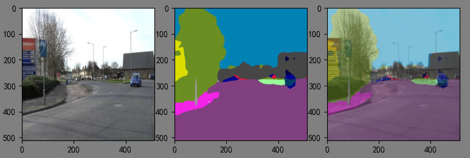

## :rocket: 编码不易，点个star！ ##

- 原始LightweightSegmentation代码：https://github.com/Tramac/Lightweight-Segmentation

#### 该项目主要学习轻量级语义分割的部署使用。

项目中已经加入Tensorboard简易功能。增加camvid数据集支持，可以展示训练但效果未测试。

| mobilenetv3_small |
| ----------------- |
||

